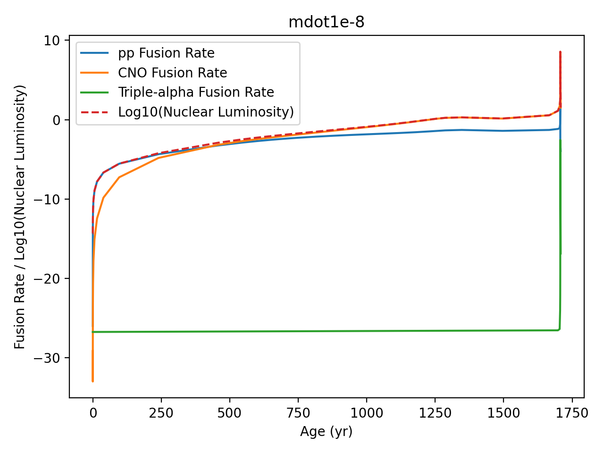

# pp-chain and CNO cycle dominance in Classical Novae

This project is to investigate the nuclear interactions between two stars in a binary system. The exchange of matter between, for example, a white dwarf (WD) and a main sequence star, forming an accretion disk in between the stellar objects. White dwarfs are rich in CO and ONe, dying from a 7-8 solar mass star after subsequent H- and He-burning.

In this project we use the MESA software for simulating the stellar evolution during the classical novae process. MESA is a 1D stellar evolution code evolving a WD + its accreted envelope using a set of physical models.

Some core models are:

The hydrostatic equilibrium equation:

$$ \frac{\partial P}{\partial m} = -\frac{Gm}{4\pi r^4}

where $P$ the pressure (where it must decrease outward from the object), $r$ radial distance from its center, $m$ mass, $G$ Newtons gravitational constant and $t$ time. 

Radiative temperature gradient:

$$ \frac{\partial T}{\partial r} = -\frac{3}{4ac}\frac{\bar{\kappa}\rho}{T^3}\frac{L_{rad}}{4\pi r^2} $$

where $T$ temperature, $a$ acceleration, $c$ speed of light, $\bar{\kappa}$  Rosseland mean opacity (average opacity intergrated over the whole range of wavelengths), $L_{rad}$ luminosity.

Time-dependent evolution of the envelope:

$$ \tau_{acc} \approx \frac{\Delta M_{acc}}{\dot{M}} $$

and others numerically solving nuclear reaction networks, convection model

We run MESA for three different mass exchange rates being $\dot{M} = $

1. $10^{-8} M_{\odot}/yr$

2. $10^{-9} M_{\odot}/yr$

3. $10^{-10} M_{\odot}/yr$

Initial conditions of the WD: 

$T_c = 5 \dot 10^{7}$ $K$
$M = 1.1$ $M_{\odot}$

More information in './my_nova/1.1M_lgTc_7.7.mod' and './my_nova/ready.mod' and for each run: './runs/mdot1e-NUMBER/1.1M_lgTc_7.7.mod'.

The results found are that pp-chain is dominant early in the lifetime of the stars and then CNO becomes main source of fuel. See for example:

